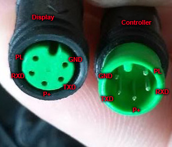

# USB-Programming-Cable for Bafang-Motors

The USB-Programming-Cable is connected to the controller instad of the display. The cable between controller and display has a green plug with 5 pins. 

Pinout of this plug:

.

(Sorry, I found this image in a blog on the internet years ago, and can't find the source anymore to give proper credit. If you know the source, please let me know, so I can add a link here.)

If you cut the cable, there are 5 wires:

- black: GND
- orange: PL
- brown: P+
- white: RXD of the controller / TXD of the display (or USB-TTL-Adapter)
- green: TXD of the controller / RXD of the display (or USB-TTL-Adapter)

To build a USB-Programming-Cable, you can use a USB-TTL-Adapter with 5V logic level. Connect GND, RXD and TXD as described above. Also, you have to short PL and P+ togheter (and isolate them, since they have Battery-Voltage on them).

Shorting the two wires is what the display does to turn on the controller. 

In a [this blog-post on electricbike.com](https://electricbike-blog.com/2015/03/17/programming-the-bbs02-without-frying-your-controller-and-losing-your-sanity/) are a pictures of  of a self-built programming cable. (Link viewed on 2026-05-11). You can see the black, white and green wires connected to the USB-TTL-Adapter, and the orange and brown wires shorted together.

